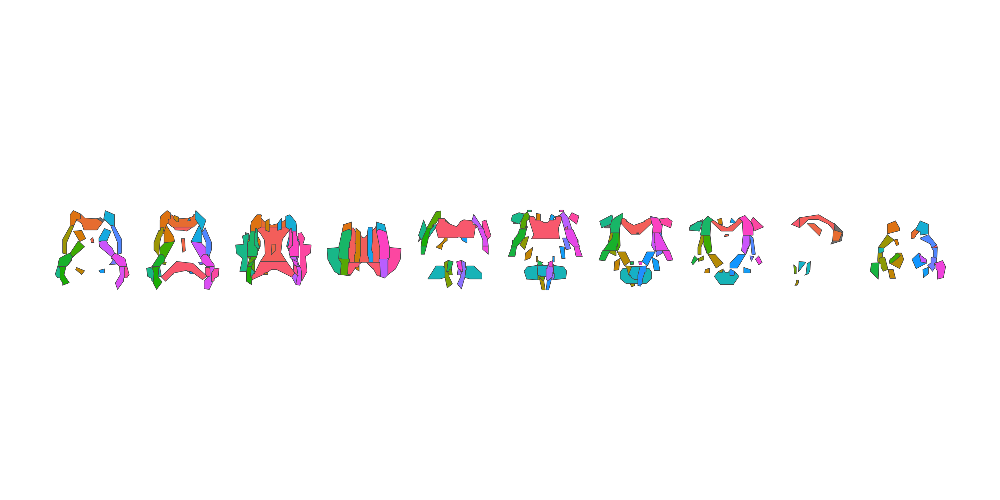

<!-- README.md is generated from README.qmd. Please edit that file -->

# ggsegJHU 

<!-- badges: start -->

[](https://github.com/ggsegverse/ggsegJHU/actions/workflows/R-CMD-check.yaml)
[](https://ggseg.r-universe.dev/ggsegJHU)
<!-- badges: end -->

This package provides JHU and ICBM white matter atlases for ggseg.

## Installation

We recommend installing the ggseg-atlases through the ggseg
[r-universe](https://ggseg.r-universe.dev/ui#builds):

``` r
options(repos = c(
  ggseg = "https://ggseg.r-universe.dev",
  CRAN = "https://cloud.r-project.org"
))

install.packages("ggsegJHU")
```

You can install this package from [GitHub](https://github.com/) with:

``` r
# install.packages("pak")
pak::pak("ggsegverse/ggsegJHU")
```

## JHU tracts

``` r
library(ggseg)
library(ggsegJHU)
library(ggplot2)

ggplot() +
  geom_brain(
    atlas = jhu_tracts(),
    mapping = aes(fill = label),
    show.legend = FALSE
  ) +
  theme_void()
```


## JHU white matter labels

``` r
ggplot() +
  geom_brain(
    atlas = jhu_wm(),
    mapping = aes(fill = label),
    show.legend = FALSE
  ) +
  theme_void()
```



## Data source

Hua K, Zhang J, Wakana S, Jiang H, Li X, Reich DS, Calabresi PA, Pekar
JJ, van Zijl PCM, & Mori S (2008). Tract probability maps in stereotaxic
spaces: Analyses of white matter anatomy and tract-specific
quantification. *NeuroImage*, 39(1), 336-347.

Mori S, Wakana S, van Zijl PCM, & Nagae-Poetscher LM (2005). *MRI Atlas
of Human White Matter*. Elsevier.
