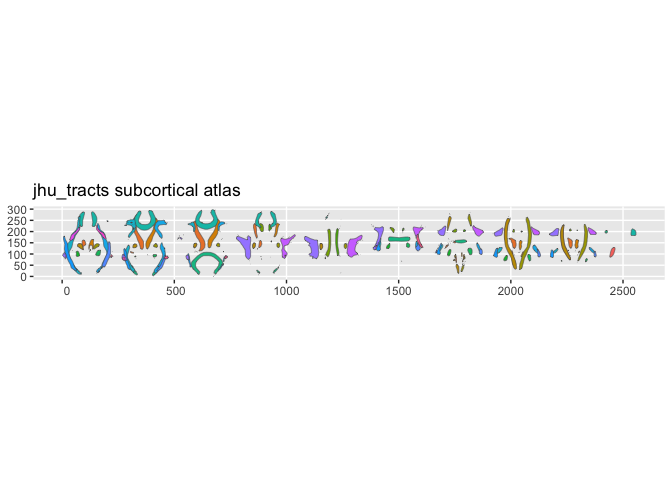
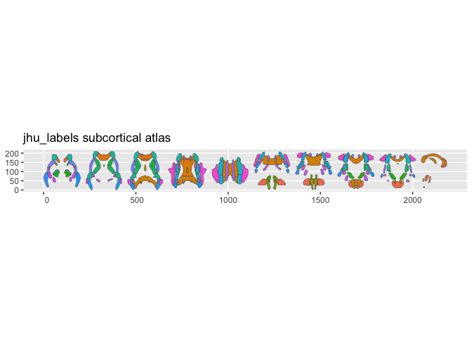

<!-- README.md is generated from README.Rmd. Please edit that file -->

# ggsegJHU

<!-- badges: start -->

[](https://github.com/ggsegverse/ggsegJHU/actions/workflows/R-CMD-check.yaml)
[](https://ggsegverse.r-universe.dev/ggsegJHU)
<!-- badges: end -->

JHU White Matter Atlases for the ggsegverse Ecosystem.

## Installation

``` r
# From r-universe
install.packages("ggsegJHU", repos = "https://ggsegverse.r-universe.dev")

# From GitHub
# install.packages("remotes")
remotes::install_github("ggsegverse/ggsegJHU")
```

## Atlases

### jhu_tracts

JHU white matter tract atlas (20 tracts).

``` r
library(ggsegJHU)
plot(jhu_tracts())
```



### jhu_labels

ICBM-DTI-81 white matter labels (48 regions).

``` r
plot(jhu_labels())
```


\## Data source

JHU-ICBM white matter atlases from FSL.

- **Reference**: Hua et al. (2008) NeuroImage 39(1):336-347; Mori et
  al. (2005)
- **Date obtained**: 2020-03-27
