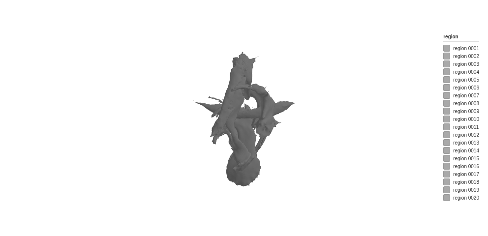
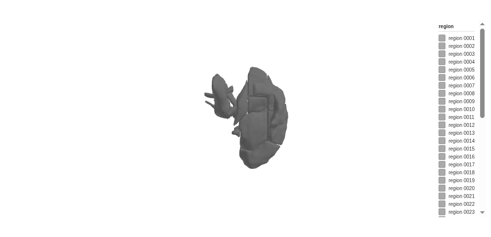
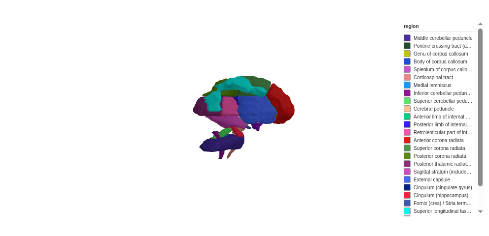

<!-- README.md is generated from README.qmd. Please edit that file -->

# ggsegJHU

<!-- badges: start -->

[](https://github.com/ggsegverse/ggsegJHU/actions)
<!-- badges: end -->

This package provides JHU and ICBM white matter atlases formatted for
use with [ggseg](https://ggseg.github.io/ggseg/) and
[ggseg3d](https://ggseg.github.io/ggseg3d/).

| Atlas                  | Function       | Regions | Reference          |
|------------------------|----------------|---------|--------------------|
| JHU Tracts             | `jhu_tracts()` | 20      | Hua et al. (2008)  |
| JHU ICBM-DTI-81 Labels | `jhu_labels()` | 48      | Mori et al. (2005) |
| ICBM DTI-81            | `icbm()`       | 26      | Mori et al. (2005) |

To learn how to use these atlases, please look at the documentation for
[ggseg](https://ggseg.github.io/ggseg/) and
[ggseg3d](https://ggseg.github.io/ggseg3d/).

## Installation

You can install ggsegJHU from [GitHub](https://github.com/) with:

``` r
# install.packages("remotes")
remotes::install_github("ggsegverse/ggsegJHU")
```

## Atlases

``` r
library(ggseg3d)
library(ggsegJHU)

ggseg3d(atlas = jhu_tracts())
```



``` r
ggseg3d(atlas = jhu_labels())
```



``` r
ggseg3d(atlas = icbm())
```


